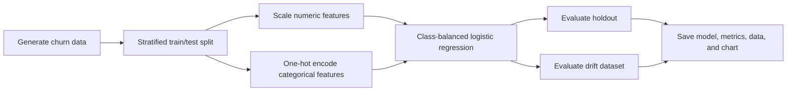

# End-to-End ML Pipeline

[](https://github.com/janakjocee/End-to-End-ML-Pipeline/actions/workflows/ci-cd.yml)

A reproducible customer-churn machine learning project with two execution paths:

- **Verified local demo:** generates data, preprocesses mixed feature types, trains a class-balanced classifier, evaluates normal and drifted data, and persists the model and reports.
- **Optional MLOps stack:** FastAPI microservices plus PostgreSQL, MongoDB, Redis, MinIO, MLflow, Airflow, Prometheus, Grafana, and Nginx through Docker Compose.

The local demo and unit suite are the repository's tested path. The larger Compose stack is an extensible reference architecture and requires Docker plus substantially more resources.

## Verified Result

The screenshot below is generated by `make demo` from a deterministic run using 5,000 synthetic customer records and a 25% stratified holdout.


| Holdout metric | Verified value |
|---|---:|
| Accuracy | 0.672 |
| Precision | 0.322 |
| Recall | 0.716 |
| F1 | 0.444 |
| ROC-AUC | 0.746 |

The class-balanced model favors churn recall over raw accuracy. On the generated drift dataset, ROC-AUC was `0.773`; use this dataset to exercise monitoring behavior, not as proof that drift improves a production model.


## Quick Start

Requirements: Python 3.10+ and `make`.

```bash
git clone https://github.com/janakjocee/End-to-End-ML-Pipeline.git
cd End-to-End-ML-Pipeline

make setup
make test
make demo
```

`make demo` creates:

```text
artifacts/demo/churn_pipeline.joblib  # fitted preprocessing + classifier pipeline
artifacts/demo/holdout.csv            # evaluation split
artifacts/demo/metrics.json           # normal and drift evaluation metrics
docs/assets/demo-pipeline-results.png # regenerated README result image
docs/assets/data-drift-comparison.png # regenerated drift scenario image
```

Run individual commands without `make`:

```bash
python3 -m venv .venv
.venv/bin/python -m pip install -r requirements-test.txt
.venv/bin/python -m pytest tests/unit -q
.venv/bin/python -m scripts.run_demo_pipeline
```

## Pipeline



The generator creates 21 customer and service fields. Churn probability is influenced by contract type, payment method, internet service, tenure, support services, senior status, and monthly charges.

## Optional Compose Stack

Docker is not needed for the verified demo. To inspect or start the reference MLOps stack:

```bash
cp .env.example .env
docker compose config --quiet
docker compose up --build
```

Primary endpoints:

| Service | URL |
|---|---|
| Inference API | `http://localhost:8000` |
| Data service | `http://localhost:8001` |
| Feature service | `http://localhost:8002` |
| Training service | `http://localhost:8003` |
| Monitoring service | `http://localhost:8004` |
| MLflow | `http://localhost:5000` |
| Airflow | `http://localhost:8080` |
| Grafana | `http://localhost:3000` |
| Prometheus | `http://localhost:9090` |
| MinIO console | `http://localhost:9001` |

Compose creates the required MinIO buckets and mounts the included PostgreSQL and Nginx configuration. Never commit `.env`; `.env.example` contains development-only placeholder credentials.

## Repository Map

| Path | Purpose |
|---|---|
| `scripts/run_demo_pipeline.py` | Verified local end-to-end workflow |
| `scripts/generate_sample_data.py` | Deterministic normal and drift data generator |
| `tests/unit/` | Fast local validation |
| `data-service/` | Dataset ingestion, validation, metadata, and storage API |
| `feature-service/` | Feature definitions, transforms, and online features |
| `training-service/` | Multi-model training and experiment tracking |
| `inference-api/` | Real-time and batch prediction API |
| `monitoring-service/` | Drift and performance monitoring |
| `model-registry/` | MLflow-backed model lifecycle API |
| `retraining-orchestrator/` | Airflow retraining DAG |
| `shared/` | Shared schemas, storage, database, logging, and metrics |
| `docs/` | Architecture and deployment reference |

## Validation

The GitHub Actions workflow runs:

1. Python compilation
2. Ruff static checks
3. Unit tests
4. A fresh end-to-end demo
5. Docker Compose configuration validation

Local validation:

```bash
make compile
make test
make demo
.venv/bin/ruff check . --exclude retraining-orchestrator
```

## Current Scope

The repository demonstrates an MLOps architecture and a working local ML lifecycle. Before production use, add authentication and authorization, secrets management, service-specific dependency locking, full integration tests against running containers, load tests, backup/restore validation, and deployment manifests.

See [system design](docs/architecture/system-design.md) and [AWS deployment reference](docs/deployment/aws.md) for the intended architecture.

## License

This project is available for learning and portfolio use. Add a formal license before redistributing it as an open-source dependency.
