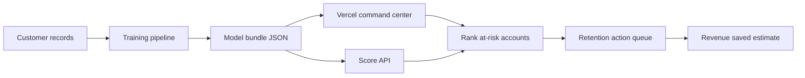
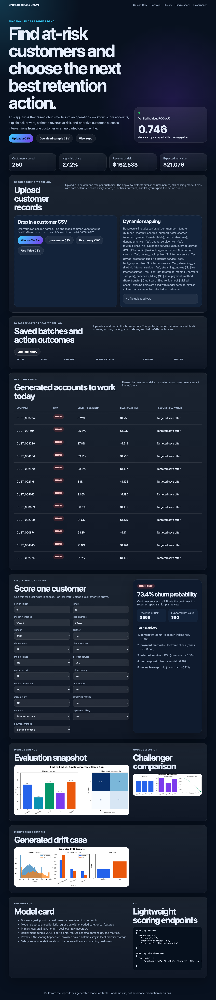
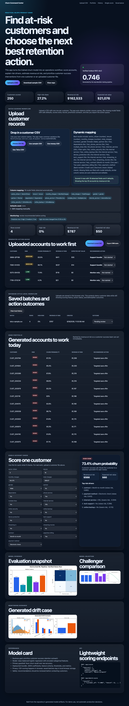
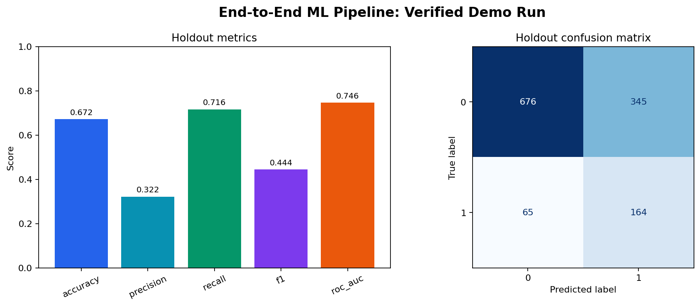
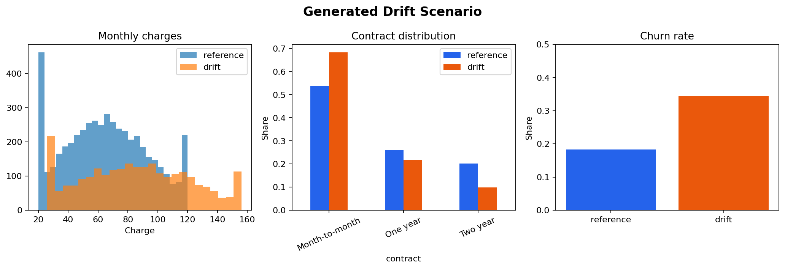
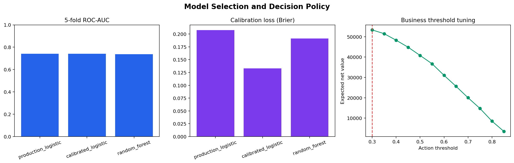
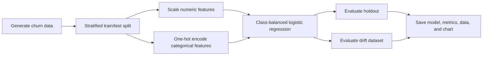

# Customer Churn Command Center

[](https://github.com/janakjocee/End-to-End-ML-Pipeline/actions/workflows/ci-cd.yml)

A practical end-to-end ML product for customer-success teams. It trains a churn model, exports a lightweight deployment bundle, scores uploaded customer files, estimates revenue at risk, recommends retention actions, and serves a Vercel-ready command center.

This repository now has three practical layers:

- **Business app:** a browser dashboard for churn scoring, revenue-at-risk prioritization, action recommendations, model evidence, and API usage.
- **ML pipeline:** reproducible data generation, preprocessing, training, evaluation, drift scenario generation, model export, and portfolio scoring.
- **MLOps reference stack:** optional FastAPI microservices plus PostgreSQL, MongoDB, Redis, MinIO, MLflow, Airflow, Prometheus, Grafana, and Nginx.

The Vercel app uses a small JSON scoring bundle instead of shipping heavy ML dependencies to serverless. This follows current deployment reality: Vercel supports Python/ASGI apps, but practical ML demos should keep serverless bundles small and push training to CI or offline jobs.

## Product Workflow



## Live Product Screenshots

The deployed dashboard presents the project as a usable customer-success workflow, not just a notebook or calculator.



Live case study: [https://end-to-end-ml-pipeline.vercel.app/case-study.html](https://end-to-end-ml-pipeline.vercel.app/case-study.html)

The upload workflow supports Telco-style CSV files, dynamic column mapping, live uploaded-data charts, monitoring warnings, database-backed batch history when Postgres is configured, browser fallback history for the public demo, action status tracking, and CRM/task export.



## What Makes It Practical

| Capability | Why it matters |
|---|---|
| Dynamic CSV upload scoring | Customer-success users can upload imperfect customer files, auto-map columns, and get a prioritized action queue. |
| Optional Postgres persistence | Production deployments can save batches, predictions, outcomes, drift reports, model versions, and audit logs. |
| Workspace access controls | Self-hosted deployments can separate workspaces and protect persistence APIs with a server-side workflow token. |
| Interactive scoring | Users can still test one account scenario without notebooks. |
| Revenue at risk | The model output is tied to a business decision, not just a probability. |
| Next-best action | Each score maps to an intervention, estimated cost, and expected lift. |
| Explainability | Top risk drivers show what moved the score. |
| Portfolio queue | Accounts are ranked by revenue at risk for daily outreach. |
| Drift scenario | The project demonstrates how distribution shifts affect monitoring. |
| Lightweight deploy | Vercel serves the dashboard and Node score API without full training dependencies. |
| CI guardrails | Compile, lint, unit tests, demo generation, web asset validation, and Compose validation. |

## Verified Result

The screenshot below is generated by `make demo` from a deterministic run using 5,000 synthetic customer records and a 25% stratified holdout.



| Holdout metric | Verified value |
|---|---:|
| Accuracy | 0.672 |
| Precision | 0.322 |
| Recall | 0.716 |
| F1 | 0.444 |
| ROC-AUC | 0.746 |
| Brier score | 0.208 |

The class-balanced model favors churn recall over raw accuracy. On the generated drift dataset, ROC-AUC was `0.773`; use this dataset to exercise monitoring behavior, not as proof that drift improves a production model.



The pipeline also runs 5-fold cross-validation across production logistic regression, calibrated logistic regression, and random forest challengers. It keeps the logistic model for the deployed bundle because it gives strong recall, compact serverless scoring, and transparent feature contributions.



The decision policy is tuned for expected retention value, not just ROC-AUC. On the generated holdout data, the business-threshold sweep recommends contacting customers above `0.30` churn probability for maximum expected net value under the documented intervention-cost assumptions.

The generated portfolio artifact currently scores `250` customer accounts:

| Business metric | Verified value |
|---|---:|
| High-risk customers | 68 |
| High-risk share | 27.2% |
| Revenue at risk | $162,533 |
| Expected net value from actions | $21,076 |

## Quick Start

Requirements: Python 3.10+, Node.js 20+, and `make`.

```bash
git clone https://github.com/janakjocee/End-to-End-ML-Pipeline.git
cd End-to-End-ML-Pipeline

make setup
make test
make demo
npm run build
```

`make demo` creates:

```text
artifacts/demo/churn_pipeline.joblib  # fitted preprocessing + classifier pipeline
artifacts/demo/holdout.csv            # evaluation split
artifacts/demo/metrics.json           # normal and drift evaluation metrics
artifacts/demo/model_bundle.json      # lightweight deployable scoring bundle
artifacts/demo/customer_scores.json   # scored customer portfolio
artifacts/demo/business_summary.json  # portfolio value summary
artifacts/demo/model_selection.json   # cross-validation and challenger results
artifacts/demo/threshold_policy.json  # business threshold sweep
docs/assets/demo-pipeline-results.png # regenerated README result image
docs/assets/data-drift-comparison.png # regenerated drift scenario image
docs/assets/model-selection-report.png # model comparison and threshold chart
public/*.json                         # web app data artifacts
public/sample-customers.csv           # schema-aligned example customer file
public/sample-flexible-customers.csv  # messy real-world-style example with alternate column names
public/telco-sample.csv               # public Telco churn-style sample columns
```

Run individual commands without `make`:

```bash
python3 -m venv .venv
.venv/bin/python -m pip install -r requirements-test.txt
.venv/bin/python -m pytest tests/unit -q
.venv/bin/python -m scripts.run_demo_pipeline
npm run build
```

## Run The Web App Locally

```bash
npm run build
npx vercel dev
```

Open the local URL that Vercel prints. The dashboard loads from `public/`, supports dynamic CSV upload in the browser, and exposes scoring endpoints at `POST /api/score` and `POST /api/batch-score`.

The CSV uploader does not require perfect model column names. It auto-detects common variations such as `MonthlyCharge`, `Monthly Fee`, `Months Active`, `Plan`, `Payment Method`, and `Account ID`, including IBM Telco-style fields like `customerID`, `SeniorCitizen`, `MonthlyCharges`, `TotalCharges`, and `Churn`. Missing model fields are filled with the model bundle defaults and shown in the mapping report before the scored action queue. Users can manually override the inferred mapping before re-scoring.

Browser workflow features:

- editable column mapping UI
- Postgres-backed saved upload history when `DATABASE_URL` is configured
- browser-only saved upload history when running as a public demo
- workspace ID, actor email, and optional workflow API token controls
- action status and outcome tracking
- input/prediction drift warnings
- live charts from the current demo or uploaded dataset
- scored CSV export
- CRM/task-board CSV export
- Web Worker scoring for larger browser uploads
- privacy-first behavior: uploaded CSV rows stay in the browser unless the API is called directly

Database workflow features:

- `GET /api/database-status` reports whether Postgres persistence is active
- `GET /api/batches` lists saved batches for the workspace
- `POST /api/batches` stores scored rows, mapping metadata, drift summary, and audit events
- `PATCH /api/batches` updates campaign outcome status
- `database/schema.sql` defines production-ready tables for workspaces, batches, predictions, action outcomes, model versions, drift reports, and audit logs

Example API request:

```bash
curl -X POST http://localhost:3000/api/score \
  -H "Content-Type: application/json" \
  -d '{
    "features": {
      "tenure": 12,
      "monthly_charges": 95,
      "total_charges": 1140,
      "contract": "Month-to-month",
      "payment_method": "Electronic check",
      "internet_service": "Fiber optic",
      "online_security": "No",
      "tech_support": "No"
    }
  }'
```

Batch API request:

```bash
curl -X POST http://localhost:3000/api/batch-score \
  -H "Content-Type: application/json" \
  -d '{
    "records": [
      {
        "Account ID": "C-1001",
        "Months Active": 12,
        "MonthlyCharge": 95,
        "LTV": 1140,
        "Plan": "Month-to-month",
        "Payment Method": "Electronic check",
        "Internet Type": "Fiber optic",
        "Security": "No",
        "Support": "No"
      }
    ]
  }'
```

## Deploy To Vercel

The repository includes `vercel.json`, `package.json`, `public/`, scoring APIs, database persistence APIs, and `database/schema.sql`.

```bash
npm run build
npx vercel --prod
```

Vercel should use:

- build command: `npm run build`
- static assets: `public/`
- serverless functions: `api/score.js`, `api/batch-score.js`, `api/batches.js`, and `api/database-status.js`

For database-backed production mode, connect a managed Postgres database such as Supabase or Neon and set:

```bash
DATABASE_URL=postgres://...
DEFAULT_WORKSPACE_ID=demo-workspace
```

To protect persisted workflow APIs in a self-hosted deployment, also set:

```bash
WORKFLOW_API_KEY=replace-with-a-long-random-secret
REQUIRE_WORKFLOW_AUTH=true
```

The browser's "Saved batches" section includes workspace, actor, and workflow-token controls. The token is stored only in that user's browser storage and sent as a bearer token to the persistence APIs. Without `DATABASE_URL`, the app stays fully usable in browser-only demo mode and avoids storing public visitor uploads on a server.

If your Vercel project is connected to GitHub, pushing `main` will trigger deployment automatically.

## ML Pipeline



The generator creates 21 customer and service fields. Churn probability is influenced by contract type, payment method, internet service, tenure, support services, senior status, and monthly charges.

## Governance

- [Model card](docs/model-card.md)
- [Data card](docs/data-card.md)
- [Completion report](docs/completion-report.md)
- [System design](docs/architecture/system-design.md)
- [AWS deployment reference](docs/deployment/aws.md)

## Optional Compose Stack

Docker is not needed for the verified demo. To inspect or start the reference MLOps stack:

```bash
cp .env.example .env
docker compose config --quiet
docker compose up --build
```

Primary endpoints:

| Service | URL |
|---|---|
| Inference API | `http://localhost:8000` |
| Data service | `http://localhost:8001` |
| Feature service | `http://localhost:8002` |
| Training service | `http://localhost:8003` |
| Monitoring service | `http://localhost:8004` |
| MLflow | `http://localhost:5000` |
| Airflow | `http://localhost:8080` |
| Grafana | `http://localhost:3000` |
| Prometheus | `http://localhost:9090` |
| MinIO console | `http://localhost:9001` |

Compose creates the required MinIO buckets and mounts the included PostgreSQL and Nginx configuration. Never commit `.env`; `.env.example` contains development-only placeholder credentials.

## Repository Map

| Path | Purpose |
|---|---|
| `public/` | Vercel-ready customer churn command center |
| `api/score.js` | Lightweight serverless scoring endpoint |
| `api/batch-score.js` | Serverless batch scoring endpoint |
| `scripts/run_demo_pipeline.py` | Verified local end-to-end workflow |
| `shared/churn_business.py` | Pure-Python scoring, action, and revenue logic |
| `scripts/generate_sample_data.py` | Deterministic normal and drift data generator |
| `tests/unit/` | Fast local validation |
| `data-service/` | Dataset ingestion, validation, metadata, and storage API |
| `feature-service/` | Feature definitions, transforms, and online features |
| `training-service/` | Multi-model training and experiment tracking |
| `inference-api/` | Real-time and batch prediction API |
| `monitoring-service/` | Drift and performance monitoring |
| `model-registry/` | MLflow-backed model lifecycle API |
| `retraining-orchestrator/` | Airflow retraining DAG |
| `shared/` | Shared schemas, storage, database, logging, and metrics |
| `docs/` | Architecture and deployment reference |

## Validation

The GitHub Actions workflow runs:

1. Python compilation
2. Ruff static checks
3. Unit tests
4. A fresh end-to-end demo
5. Vercel web asset validation
6. Docker Compose configuration validation

Local validation:

```bash
make compile
make test
make demo
npm run build
.venv/bin/ruff check . --exclude retraining-orchestrator
```

## Current Scope

The web app is practical for a portfolio/demo and can be hosted. It includes dynamic CSV upload, editable mapping, uploaded-data charts, browser fallback history, optional Postgres batch persistence, workspace controls, optional API-token protection, action tracking, drift warnings, CRM/task export, model selection evidence, and deployed APIs. Before using it for real customer decisions, add organization authentication through a provider such as Supabase Auth, Clerk, or Auth.js; row-level tenant policies; consent/compliance checks; live CRM API credentials; post-intervention outcome ingestion from real systems; fairness review on real protected classes; model recalibration; and production observability.

## License

This project is available for learning and portfolio use. Add a formal license before redistributing it as an open-source dependency.
